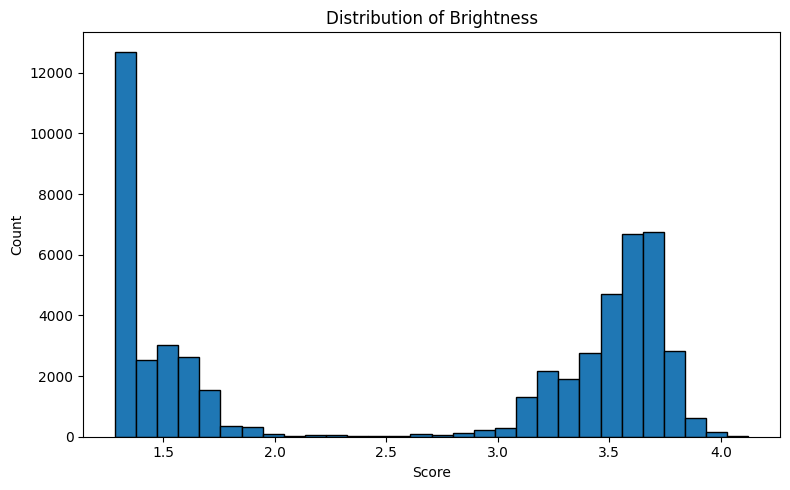
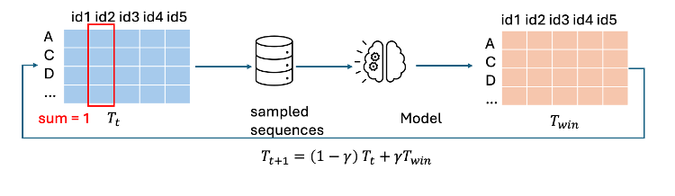

# Enhance the **Brightness** and **Thermalstability** of avGFP

### Dataset Provided
- avGFP_full_sequences.csv
- Exclusion_List.csv
- GFP data.xlsx
- 4 kinds of GFP Protein Structures
- WildType AAseqs of 4 GFP Proteins

### Getting Started

To get started, please ensure the following dependencies are installed:
```
pyrosetta=2025.19+release.1354d05daa
pyrosetta-installer==0.1.2
torch=2.2.1+cu118
biopython==1.85
seaborn==0.13.2
```
We use ESMFold to predict the structure of avGFP variants. Note that using their API may be rate-limited. You are encouraged to follow the [official ESMFold GitHub repository](https://github.com/facebookresearch/esm) for local deployment.


### Cascade Learning Strategy
We adopt a cascade learning strategy:
- A binary classification model is used as the upstream task to predict whether a variant's brightness exceeds 2.5.
- A regression model is used downstream to predict the actual brightness of only high-class variants.
Compared to a direct regression approach, our cascade setup improves precision in the high-brightness region — which is our primary design target.

### Preprocessing

After setting up the environment, run **Section 1** of `script/data_process.ipynb` to prepare the training and validation datasets.
If you want to incorporate **spatial-distance attention masks** into your model, ensure the following:
- Run the relevant section in the notebook to generate the mask.
- Set `residue_mask=True` in the `ItPredConfig` class (in `script/model.py`).

### Binary Classification Training

To predict whether a variant's brightness exceeds 2.5 (threshold chosen based on the bimodal distribution), run:
```
cd script
python cls_train.py
```



A trained classifier is provided under `checkpoints/`, with the following performance:
```
acc:  0.9779
recall:  0.9832
precision:  0.9781
f1 score:  0.9807
```

### Regression Model Training

Only variants classified as high-brightness are used for regression training, since we are primarily interested in the top performers.

Run regression training with:
```
cd script
python reg_train --structure
```

The table below compares performance with and without structural information:
|Performance | With Structure | Without Structure |
|--------|--------|--------|
|5% Acc| | |
|NDCG (k=10)| | |
|Spearmanr | | |
|R²| | |

### Inference: Predict Variant Brightness

To predict brightness using the trained model:

```
from model import ItPred4Classification, ItPredConfig

seq = '*PUTYOURSEQUENCEHERE*'

config = ItPredConfig(320)
cls_model = ItPred4Classification(config)
cls_model.load_state_dict(torch.load('../checkpoints/cls_model100.pt'))

structure = False
with open('../checkpoints/ml_reg_wo_structure.pkl', 'rb') as f:
    reg_model = pickle.load(f)

print(predict(seq, cls_model, reg_model, structure, True))
    
```

### Mutation Library Design via EDA

We extracted all **high-brightness** variants and analyzed the **mutation distribution** to identify key contributing residues. Then, we performed **Estimation of Distribution Algorithms (EDAs)** to build a probabilistic mutation table.

Through iterations, the probability distribution converges, allowing us to focus mutation design on a reduced set of residues.

 

Run the EDA algorithm with:

```
cd script
python EDA.py
```

### Thermostability Screening via Rosetta

We selected top-brightness variants predicted by our model and used **Rosetta** energy scoring to further evaluate their thermostability. This dual filtering (ML + biophysical evaluation) allowed us to identify variants with both high brightness and strong structural stability.